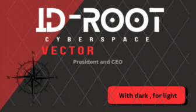

<!-- HEADER & TYPING EFFECT -->

  

  

---

  

<!-- INTRO SECTION -->

#  

**`[USER]`**: root@github

**`[PRIVILEGES]`**: uid=0(root) gid=0(root) groups=0(root) 

**`[Knowledge Level]`**: Intermidiate

**`[FOCUS]`**: Post-Exploitation | Active Directory | Binary Exploitation

> **Open your eyes, the truth lies
**
#  
<!-- ARSENAL / TECH STACK -->
╔══  [ $ cat arsenal.txt ]  ══════════════════════════════════════════════╗
║ USER: root@archlinux     STATUS: LEARNING                               ║
╠═════════════════════════════════════════════════════════════════════════╣
║                                                                         ║
║  [+] MODULE_01: LANGUAGES                                               ║
║  0x00 C                  [█████████████████░░░]  85% ::  COMPILING      ║
║  0x01 Python             [████████████████████]  100% :: COMPLETED      ║
║  0x02 Rust               [█████████████████░░░]   85% :: COMPILING      ║
║  0x03 Assembly (x64)     [█████████████░░░░░░░]   65% :: DEBUGGING      ║
║                                                                         ║
║  [+] MODULE_02: OFFENSIVE_OPERATIONS                                    ║
║  0x04 Metasploit/C2      [████████████████░░░░]   80% :: ARMED          ║
║  0x05 Network/Nmap       [██████████████░░░░░░]   70% :: SCANNING       ║
║  0x06 Reverse/Ghidra     [████████████░░░░░░░░]   60% :: ANALYZING      ║
║  0x07 Web/BurpSuite      [████████████░░░░░░░░]   60% :: PROXYING       ║
║                                                                         ║
║  [+] MODULE_03: INFRASTRUCTURE                                          ║
║  0x08 Linux              [████████████████████]  100% :: MASTERED       ║
║  0x09 Neovim (Lua)       [████████████████░░░░]   80% :: CONFIGURED     ║
║  0x0A Bash Scripting     [███████████████░░░░░]   75% :: EXECUTING      ║
║  0x0B Docker/Container   [████████░░░░░░░░░░░░]   40% :: DEPLOYING      ║
║                                                                         ║
╚═════════════════════════════════════════════════════════════════════════╝
---

