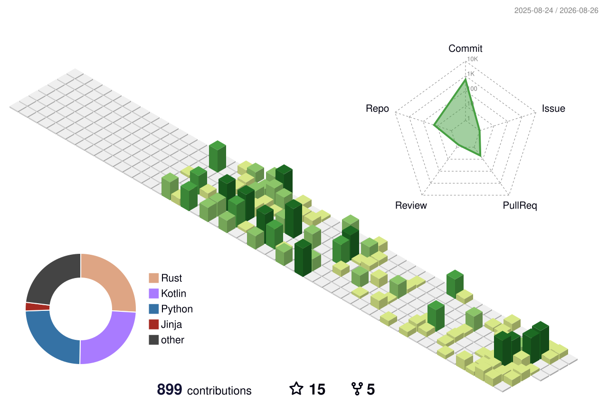

  

  
  
  
  
  
  
  

### `$ cat about.md`

Linux, Neovim, and a shell prompt that rarely closes. Most of my time goes into post-exploitation, Active Directory, and binary exploitation.Love to work with Artificial Intelligence.

 

### `$ cat skills.chart`

  

### `$ ./profile-3d-contrib.sh`

  

